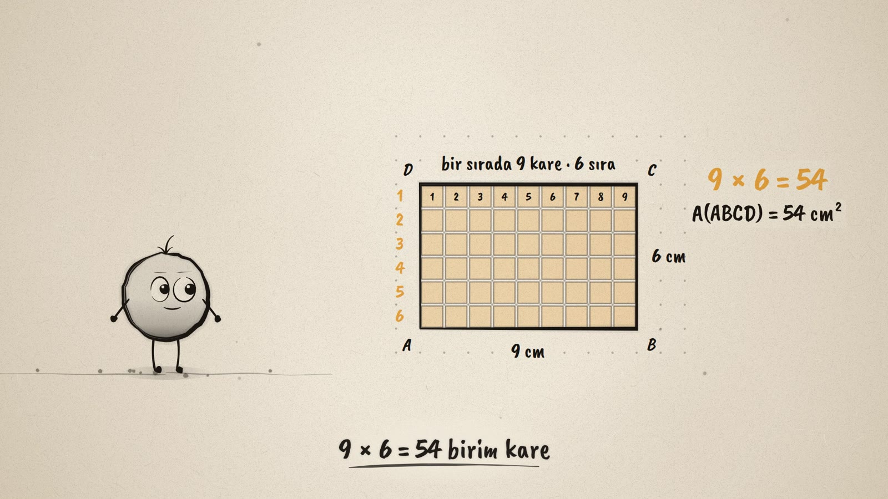
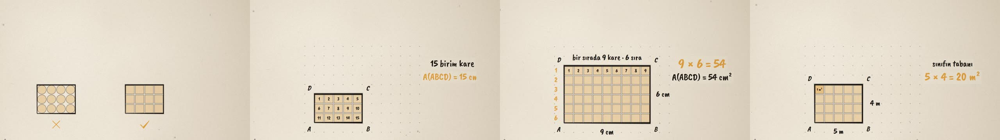

# Birim Kareler · Unit Squares

**▶ Tarayıcıda izleyin / Watch in the browser:** https://hakanatas.github.io/birim-kareler/ 
**⬇ MP4 + altyazılar / MP4 + subtitles:** [Releases](https://github.com/hakanatas/birim-kareler/releases) 
**✎ Kullanılan istem / The prompt behind it:** [PROMPT.md](PROMPT.md) 
**🎞 Bütün filmler / All films:** [Nokta'nın Filmleri](https://hakanatas.github.io/nokta-filmleri/)

> **TR —** 5. sınıf matematik "Geometrik Nicelikler" temasındaki MAT.5.4.2 öğrenme çıktısı için hazırlanmış, tamamen JavaScript ile çizilen 92 saniyelik mürekkep animasyonu. Önce alanı ölçmek için bir birim seçiliyor: daireler boşluk bırakıyor, kareler bırakmıyor. Kenarı 1 cm olan kare birim kare olarak seçiliyor (1 cm²). 5 × 3'lük dikdörtgen tek tek sayılıyor (15 cm²). 9 × 6'lık dikdörtgen sıra sıra dolduruluyor (9 × 6 = 54). Buradan alan bağıntısına varılıyor: alan, iki ardışık kenarın çarpımıdır. Film büyük alanlar için metrekareyle (5 m × 4 m = 20 m²) bitiyor. Altyazılar Türkçe, İngilizce ya da ikisi birlikte seçilebilir.

A 92-second ink animation for **5th-grade maths**, drawn entirely with JavaScript on an HTML5 canvas. It is the second film of the *Geometrik Nicelikler* theme, after [Aynı Çevre](https://github.com/hakanatas/ayni-cevre). Nokta, the ink character from [The Learning Ink](https://github.com/hakanatas/the-learning-ink), is the guide again.

## Learning outcome

MEB, Türkiye Yüzyılı Maarif Modeli, Ortaokul Matematik, 5th grade, "Geometrik Nicelikler" theme:

**MAT.5.4.2. Birim karelerden yola çıkarak dikdörtgenin alanını değerlendirebilme**
- a) Dikdörtgenin alanını ölçmede, seçtiği birim kareleri ölçüt olarak belirler.
- b) Dikdörtgenin alanını seçilen birim karelerle ölçer.
- c) Birim kare sayısının dikdörtgenin iki ardışık kenar uzunluğu ile ilişkisini inceler.
- ç) Dikdörtgenin alan bağıntısına (iki ardışık kenarın uzunlukları çarpımı) ilişkin yargıda bulunur.

The program's notes ask students to measure with unit squares, and to ask "Toplam birim kare sayısına nasıl ulaşabilirsiniz?" when the area gets large. Students should then discover that the number of unit squares equals the product of two adjacent sides. Units are cm² and m², with no conversion between them. Notation: A(ABCD).

## Scenes

| # | Time | Scene | What happens | Outcome |
|---|---|---|---|---|
| 1 | 0–10 s | İçi ne kadar? | Nokta draws a 5 × 3 rectangle. "How big is the inside?" | Intro |
| 2 | 10–24 s | Birim seçelim | Circles leave gaps; squares cover with none. A square with 1 cm sides is the unit square, 1 cm². | 5.4.2 a |
| 3 | 24–38 s | Sayalım | The rectangle is covered one square at a time, counting 1 … 15. A(ABCD) = 15 cm². | 5.4.2 b |
| 4 | 38–56 s | Sıra sıra | A 9 × 6 rectangle: counting one by one would take long. It fills row by row, 9 squares in a row and 6 rows, so 9 × 6 = 54. | 5.4.2 c |
| 5 | 56–70 s | Alan bağıntısı | 7 × 4 = 28: the side lengths are the number of squares in a row and the number of rows. Alan = uzun kenar × kısa kenar. | 5.4.2 ç |
| 6 | 70–84 s | Metrekare | For big places the unit is 1 m²: a classroom floor of 5 m × 4 m = 20 m². | cm², m² |
| 7 | 84–92 s | Aklında kalsın | "Alan = birim kare sayısı = uzun kenar × kısa kenar." Nokta celebrates. | Wrap-up |

## Running it

- **Preview:** double-click `index.html` (it works offline).
- **MP4:** run `npm install` once, then `npm run export -- --format=horizontal --captions=tr`.
- **Subtitles and narration:** `npm run srt` writes `out/captions_*.srt` and `narration_notes.txt`.
- **Editing:**
  - Caption text, timings and narration notes: `captions.js`
  - Scenes: `scenes/scene1.js` … `scene7.js`
  - The rectangle's size over time (`W`, `H`), unit squares (`unit`, `tiles`) and Nokta's poses: `src/draw/film.js`

It uses the same engine as The Learning Ink: `renderFrame(t)` as a pure function of time, seeded randomness, and frame-by-frame export.

## Lisans · License

**TR —** Bu film ve kodu [Creative Commons Atıf-GayriTicari 4.0 Uluslararası (CC BY-NC 4.0)](https://creativecommons.org/licenses/by-nc/4.0/deed.tr) lisansıyla paylaşılır. Ticari olmayan her amaçla (derste, okulda, eğitim materyalinde) kopyalayabilir, paylaşabilir ve değiştirebilirsiniz; ancak **kaynak göstermek zorunludur**: eser sahibinin adı ve bu deponun bağlantısı belirtilmeden kullanılamaz. Ticari kullanım (satış, ücretli ürün ya da yayın) için izin alınmalıdır.

**EN —** This film and its code are licensed under [Creative Commons Attribution-NonCommercial 4.0 International (CC BY-NC 4.0)](https://creativecommons.org/licenses/by-nc/4.0/). You may copy, share and adapt them for non-commercial purposes, but **attribution is required**: they may not be used without crediting the author and linking to this repository. Commercial use requires permission.

Atıf örneği / Required credit: *“Birim Kareler”, Hakan Ataş, Nokta'nın Filmleri — https://github.com/hakanatas/birim-kareler — CC BY-NC 4.0*
